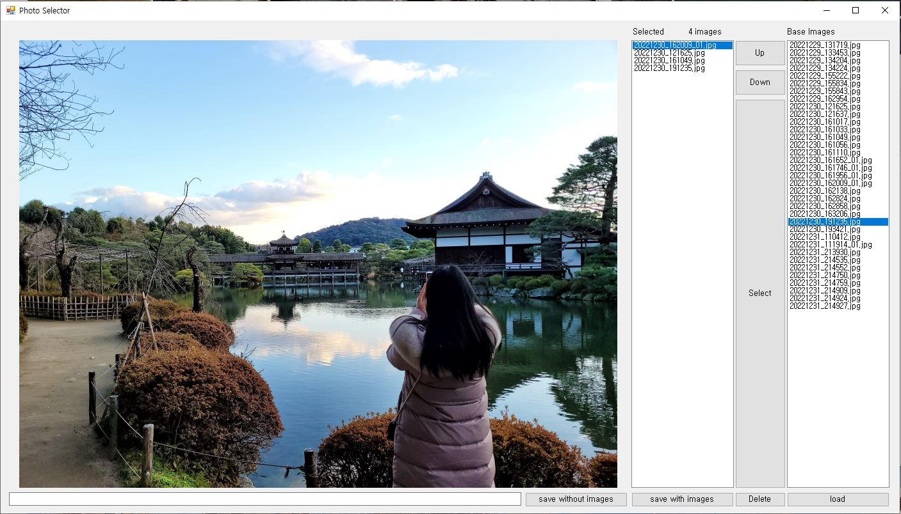

# PhotoSelector [다운로드]([https://github.com/BKLim87/PhotoSelector/raw/main/photo_selector.zip](https://github.com/BKLim87/PhotoSelector/blob/da214e71e2053594e8d625b56e7e278283ae5525/photo_selector.exe))
## 예시

## 목적

 많은 사진들중에서 필요한 사진을 고르고 그 사진들의 순서를 배열하고 추가적으로 필요한 설명들을 적을 수 있습니다. 
## 사용법
 0. 위의 다운로드 링크를 클릭하여 photo_selector.exe파일을 다운받아 실행합니다.
 1. load버튼을 눌러 필요한 사진들을 불러옵니다. 
 2. base 사진들 중에서 사진을 골라 Select버튼으로 선택합니다. 
 3. 아래의 요청사항 칸에 내용을 적습니다. 
 4. 선택된 사진들의 순서를 Up, Down버튼으루 수정합니다.
 5. 선택된 사진을 제고하고 싶으면 Delete버튼으로 제거합니다. 
 6. 작업이 완료되었으면 save without images, save with images버튼으로 저장할 폴더를 선택하여 저장합니다.
 6.1 save without images는 선택된 파일과 요청사항을 기록한 appendix.txt 파일만 저장합니다. 
 6.2 save with images는 appendix.txt 파일과 선택된 이미지들이 저장하는 폴더에 저장됩니다. 
 저장하는 폴더는 되도록이면 빈 폴더로 선택하고, 파일이 덮어써질 수 있으니 주의합니다. 
 사진은 선택된 사진창의 순서대로 파일명과 요청사항이 선택된 폴더의 appendix.txt파일에 저장됩니다. 
## 본 목적

 웨딩 사진들을 보정업체에 맡기려보니 비슷한 사진이 너무 많아 만들어 보았습니다. 코로나 시대 결혼식을 앞둔 예비 신혼부부들께 바칩니다.
